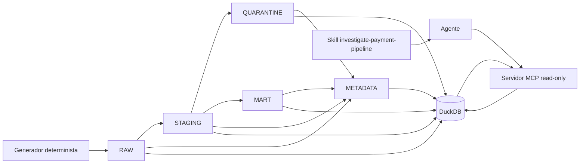

<div align="center">

# dataops-agent-poc

### POC educativa de confiabilidad para Data Engineering

[](https://www.python.org/)
[](https://duckdb.org/)
[](https://docs.astral.sh/uv/)
[](https://docs.pytest.org/)
[](https://docs.astral.sh/ruff/)
[](https://modelcontextprotocol.io/)
[](https://github.com/features/codespaces)

</div>

> **Aviso:** todos los datos, personas, pagos y resultados de esta POC son ficticios. No se
> utilizan datos reales ni sistemas de producción.

Esta POC muestra cómo generar un batch reproducible, validarlo en DuckDB y exponer evidencia
agregada mediante un servidor MCP de solo lectura. Una skill guía al agente para investigar una
diferencia entre registros esperados y publicados sin consultar la base directamente ni modificar
datos.

## Qué demuestra la POC

- Generación determinista de un batch de pagos para `2026-09`.
- Pipeline DuckDB con capas `RAW`, `STAGING`, `QUARANTINE`, `MART` y `METADATA`.
- Reglas de calidad explícitas, dinero con `Decimal` y persistencia `DECIMAL(18,2)`.
- Inmutabilidad de RAW mediante hash, replay idempotente y rollback transaccional.
- Servidor MCP local por STDIO con exactamente tres herramientas agregadas y de solo lectura.
- Skill de investigación que separa hechos, inferencias y recomendaciones.
- Verificación automatizada mediante un cliente MCP SDK real, sin afirmar una integración Codex E2E no comprobada.

## Arquitectura



La skill guía al agente; el agente utiliza MCP; y MCP consulta DuckDB mediante consultas fijas y
parametrizadas. La skill no consulta DuckDB directamente.

## Escenario ficticio

El batch de pagos de `2026-09` recibe 10.000 filas y publica 9.880. Las 120 filas no publicadas
se conservan en cuarentena para mantener trazabilidad y preparar un replay seguro.

| Métrica | Resultado |
| --- | ---: |
| Entrada RAW | 10.000 |
| STAGING | 10.000 |
| MART | 9.880 |
| QUARANTINE | 120 |
| `MISSING_PERSON` | 115 |
| `INVALID_AMOUNT` | 5 |

Estos números describen la fixture educativa, pero las conclusiones deben basarse en los valores
devueltos por una ejecución del pipeline o por las herramientas MCP.

## Principios de ingeniería

- **Reproducibilidad:** `uv.lock`, configuración explícita y rutas locales permiten reconstruir el entorno.
- **Determinismo:** el mismo período y semilla producen el mismo RAW y el mismo hash.
- **Idempotencia:** repetir el mismo run no duplica filas ni cambia el resultado de negocio.
- **Inmutabilidad:** RAW no se sobrescribe si ya existe con otro contenido.
- **Atomicidad:** una transacción publica capas derivadas o revierte el cambio completo.
- **Trazabilidad:** run ID, hashes, conteos, reglas y auditoría relacionan cada resultado con su ejecución.
- **Separación de responsabilidades:** generación, calidad, pipeline, persistencia, MCP y skill tienen límites claros.
- **Seguridad por diseño:** MCP es read-only, usa consultas fijas, valida períodos y devuelve datos agregados.

## Responsabilidad de cada componente

| Componente | Responsabilidad |
| --- | --- |
| Generador | Crear 10.000 pagos ficticios deterministas. |
| Calidad | Clasificar filas y asignar códigos de rechazo. |
| Pipeline | Persistir capas, metadata y garantías transaccionales en DuckDB. |
| DuckDB | Almacenar localmente las capas y la evidencia operacional. |
| Servidor MCP | Exponer evidencia agregada mediante herramientas read-only. |
| Skill | Definir el orden, límites y formato de la investigación. |
| Agente | Llamar MCP, interpretar evidencia y redactar el informe. |

## Tecnologías

Python 3.12, DuckDB, `uv`, pytest, Ruff, Model Context Protocol (MCP) y GitHub Codespaces.

## Inicio rápido

### Codespaces

Abre este repositorio en GitHub Codespaces. El entorno incluye Python y las herramientas locales
necesarias; no requiere credenciales ni acceso de red para ejecutar la POC.

### Instalar dependencias

Desde la raíz del repositorio:

```bash
uv sync --frozen
```

Este comando instala exactamente las versiones fijadas en `uv.lock`.

### Ejecutar el pipeline

```bash
DATAOPS_DB_PATH=data/generated/warehouse.duckdb \
DATAOPS_AUDIT_PATH=evidence/generated/mcp_audit.jsonl \
DATAOPS_PERIOD=2026-09 \
DATAOPS_SEED=42 \
uv run python -c "from dataops_agent_poc.pipeline import run_pipeline; print(run_pipeline())"
```

Genera la base local, clasifica las filas y conserva la auditoría en una ruta ignorada por Git.

### Ejecutar Ruff y pytest

```bash
uv run ruff check .
uv run pytest
```

Ruff comprueba el estilo y errores estáticos; pytest verifica generación, pipeline, reglas,
contratos MCP, skill y el walking skeleton MCP por STDIO.

## Herramientas MCP

El servidor se registra para el cliente Codex en `.codex/config.toml` y se inicia por STDIO:

- `get_payment_batch(period)`: devuelve metadata y conteos agregados del batch.
- `reconcile_payment_layers(period)`: comprueba conservación entre RAW, STAGING, MART y QUARANTINE.
- `get_rejection_reasons(period)`: devuelve códigos, motivos y cantidades agregadas.

No existe herramienta de escritura, SQL arbitrario ni consulta de registros individuales.

## Skill `investigate-payment-pipeline`

La skill activa una investigación solo para diferencias, rechazos o reconciliaciones de batches de
pagos de esta POC. Obliga a llamar las tres herramientas en orden, detenerse ante evidencia
faltante o inconsistente, distinguir hechos de inferencias y proponer un replay sin ejecutarlo.

## Evidencia y auditoría

Cada llamada MCP escribe un evento JSONL sanitizado con timestamp, herramienta, período, resultado
y duración. No se guardan respuestas completas ni registros individuales. Las bases DuckDB y las
evidencias generadas están excluidas de Git.

## Estado real del proyecto

### Comprobado

- Pipeline DuckDB, conteos ficticios y reglas de calidad.
- Determinismo, inmutabilidad RAW, idempotencia, atomicidad, rollback y trazabilidad.
- Protocolo MCP STDIO mediante cliente SDK real y las tres herramientas read-only.
- Auditoría JSONL y ausencia de exposición de registros individuales.
- Contrato, frontmatter, flujo y límites de la skill.
- Ruff y suite automatizada.

### Pendiente

La invocación MCP desde una sesión autenticada del cliente Codex no está comprobada. `codex mcp
list` encuentra la configuración local, pero esta POC no inicia autenticación. La limitación
pertenece a la integración del cliente y su autenticación; no al protocolo MCP ni a DuckDB.

## Limitaciones conocidas

- Es una POC educativa local, no un sistema de pagos ni una integración de producción.
- No ejecuta replay automático ni corrige datos.
- No utiliza autenticación, despliegue remoto ni datos reales.
- La prueba MCP SDK valida el protocolo, no el comportamiento E2E de Codex.

## Índice de documentación

- [Estado verificable](docs/STATUS.md)
- [01. Entorno](docs/learning/01-environment.md)
- [02. Pipeline determinista](docs/learning/02-deterministic-pipeline.md)
- [03. Servidor MCP](docs/learning/03-mcp-server.md)
- [04. Skill de investigación](docs/learning/04-investigation-skill.md)
- [Resumen y alcance del proyecto](docs/PROJECT_BRIEF.md)
- [Instrucciones del repositorio](AGENTS.md)
- [Skill instalada](.agents/skills/investigate-payment-pipeline/SKILL.md)

## Estructura principal

```text
.
├── .agents/skills/investigate-payment-pipeline/SKILL.md
├── .codex/config.toml
├── docs/
│   ├── STATUS.md
│   ├── PROJECT_BRIEF.md
│   └── learning/
├── src/dataops_agent_poc/
│   ├── generation.py
│   ├── quality.py
│   ├── pipeline.py
│   ├── mcp_repository.py
│   ├── mcp_business.py
│   └── mcp_server.py
├── tests/
├── .env.example
├── pyproject.toml
└── uv.lock
```

## Próximos pasos

1. Repetir la investigación desde un cliente Codex autenticado y documentar la evidencia real.
2. Mantener separadas las pruebas unitarias, de pipeline, de protocolo y E2E.
3. Ampliar ejercicios pedagógicos sin introducir datos reales, escrituras externas ni herramientas MCP de modificación.
